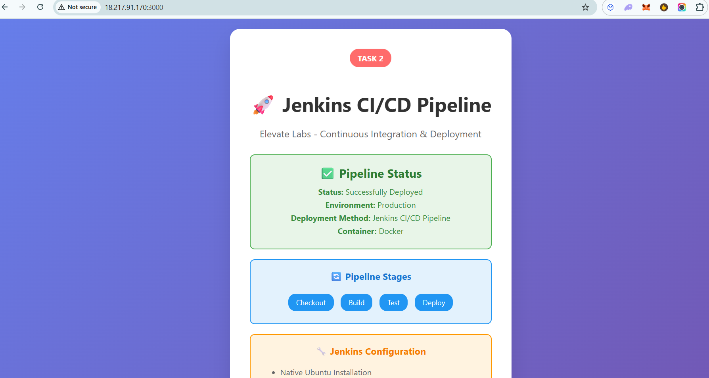
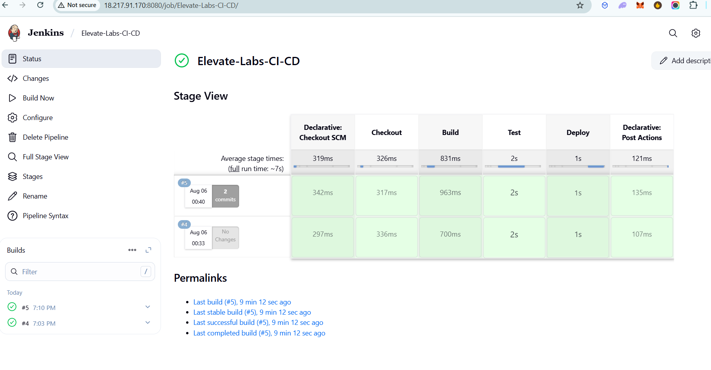

# Task 2: Jenkins CI/CD Pipeline

## Overview
Jenkins CI/CD pipeline implementation for the Elevate Labs application on Ubuntu server.

## Requirements ✅
- Jenkins on Ubuntu server
- Docker integration
- Automated testing
- Continuous deployment

## Architecture
- **Server**: Ubuntu 22.04 LTS (18.217.91.170)
- **CI/CD**: Jenkins (Native Installation)
- **Container**: Docker
- **Runtime**: Node.js

## Setup

### 1. Server Setup
```bash
# Install Java 17
sudo apt install -y openjdk-17-jdk

# Install Docker
sudo apt install -y docker.io
sudo systemctl start docker
sudo systemctl enable docker

# Install Jenkins
wget -q -O - https://pkg.jenkins.io/debian-stable/jenkins.io.key | sudo apt-key add -
sudo sh -c 'echo deb https://pkg.jenkins.io/debian-stable binary/ > /etc/apt/sources.list.d/jenkins.list'
sudo apt update
sudo apt install -y jenkins

# Add jenkins user to docker group
sudo usermod -aG docker jenkins
sudo systemctl start jenkins
sudo systemctl enable jenkins
```

### 2. Jenkins Configuration
**Required Plugins:**
- Git plugin
- Docker plugin
- Pipeline plugin

**Credentials:**
- GitHub personal access token

### 3. Pipeline Configuration

#### Jenkinsfile
```groovy
pipeline {
    agent any
    
    environment {
        DOCKER_IMAGE = 'elevate-labs-app'
        DOCKER_TAG = "${env.BUILD_NUMBER}"
        CONTAINER_NAME = 'elevate-labs-container'
    }
    
    stages {
        stage('Checkout') {
            steps {
                checkout scm
            }
        }
        
        stage('Build') {
            steps {
                dir('task-1') {
                    sh "docker build -t ${DOCKER_IMAGE}:${DOCKER_TAG} ."
                }
            }
        }
        
        stage('Test') {
            steps {
                dir('task-1') {
                    sh "docker run --rm ${DOCKER_IMAGE}:${DOCKER_TAG} npm test"
                }
            }
        }
        
        stage('Deploy') {
            steps {
                sh "docker stop ${CONTAINER_NAME} || true"
                sh "docker rm ${CONTAINER_NAME} || true"
                sh "docker run -d --name ${CONTAINER_NAME} -p 3000:3000 ${DOCKER_IMAGE}:${DOCKER_TAG}"
            }
        }
    }
}
```

## Results

### Application Screenshot


### Jenkins Pipeline Screenshot


### Pipeline Statistics
- **Total Builds**: 5 successful builds
- **Average Build Time**: ~7 seconds
- **Success Rate**: 100%
- **Pipeline Job**: Elevate-Labs-CI-CD

## Access URLs
- **Application**: http://18.217.91.170:3000
- **Jenkins**: http://18.217.91.170:8080

## Health Checks
- **Application Health**: `/health`
- **API Info**: `/api/info`
- **Status**: `/api/status`

## Monitoring
```bash
# Jenkins logs
sudo journalctl -u jenkins -f

# Docker logs
docker logs elevate-labs-container

# Application status
curl http://18.217.91.170:3000/health
```

## API Endpoints
| Endpoint | Method | Description |
|----------|--------|-------------|
| `/` | GET | Landing page |
| `/health` | GET | Health check |
| `/api/info` | GET | Application info |
| `/api/status` | GET | Status information |

---

**Task 2: Jenkins CI/CD Pipeline - Elevate Labs** 
