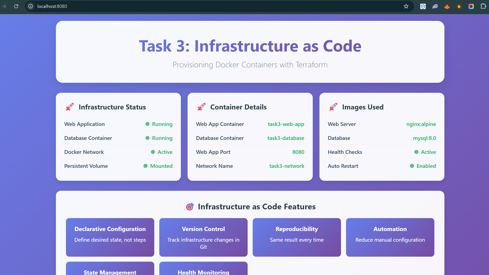

# Task 3: Infrastructure as Code (IaC) with Terraform

## 🎯 Objective
Provision a local Docker container using Terraform to understand Infrastructure as Code principles.

## 🛠️ Tools Used
- **Terraform**: Infrastructure as Code tool
- **Docker**: Container platform
- **Docker Provider**: Terraform provider for Docker

## 📁 Project Structure
```
task-3/
├── main.tf              # Main Terraform configuration
├── variables.tf         # Variable definitions
├── outputs.tf          # Output values
├── terraform.tfvars    # Variable values (optional)
├── .gitignore          # Git ignore file
└── README.md           # This documentation
```

## 🚀 What This Project Does

### **Infrastructure Components:**
1. **Docker Network**: Creates a bridge network for container communication
2. **Docker Volume**: Persistent storage for data
3. **Web Application Container**: Nginx web server
4. **Database Container**: MySQL database
5. **Health Checks**: Automated health monitoring
6. **Environment Variables**: Configurable settings

### **📸 Running Application Screenshot:**



*Custom nginx dashboard showing Task 3 Infrastructure as Code implementation*

### **🐳 Proof of Running Containers:**


*Screenshot showing both `task3-web-app` and `task3-database` containers running successfully with healthy status*

**Container Details:**
- **task3-web-app**: Running on port 8080 (healthy)
- **task3-database**: Running on port 3306 (healthy)
- **Network**: task3-network (bridge)
- **Volume**: task3-data (persistent storage)


### **Terraform Features Demonstrated:**
- ✅ **Provider Configuration**: Docker provider setup
- ✅ **Resource Management**: Networks, volumes, containers
- ✅ **Variable Usage**: Configurable parameters
- ✅ **Output Values**: Information display
- ✅ **Health Checks**: Container monitoring
- ✅ **State Management**: Infrastructure tracking

## 🛠️ Setup Instructions

### **Prerequisites:**
1. **Install Terraform**: https://www.terraform.io/downloads
2. **Install Docker**: https://docs.docker.com/get-docker/
3. **Start Docker**: Ensure Docker daemon is running

### **Step 1: Initialize Terraform**
```bash
cd task-3
terraform init
```

### **Step 2: Plan the Infrastructure**
```bash
terraform plan
```
This shows what Terraform will create without making changes.

### **Step 3: Apply the Infrastructure**
```bash
terraform apply
```
This creates the actual Docker containers and resources.

### **Step 4: Verify the Infrastructure**
```bash
terraform state list
terraform show
```

### **Step 5: Access the Application**
- **Web App**: http://localhost:8080
- **Database**: Accessible via Docker network

### **Step 6: Destroy the Infrastructure**
```bash
terraform destroy
```
This removes all created resources.