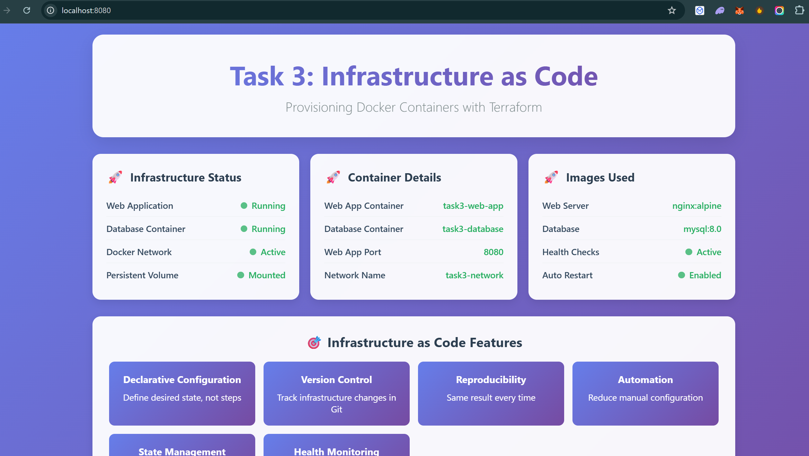

# Task 4: Build a Version-Controlled DevOps Project with Git

## Objective
Manage a DevOps project using Git best practices and proper version control workflows.

## Tools
- Git
- GitHub

## Deliverables
- Project repository with proper commits and branching
- Well-structured Git workflow
- Comprehensive documentation

## Task Requirements

### ✅ Completed Tasks

**a. Initialize repo and push to GitHub**
```bash
git init
git remote add origin https://github.com/username/devops-project.git
git add .
git commit -m "feat: initial project setup"
git push -u origin main
```

**b. Create dev, feature, and main branches**
```bash
# Create and switch to dev branch
git checkout -b dev
git push -u origin dev

# Create feature branch
git checkout -b feature/initial-setup
git push -u origin feature/initial-setup
```

**c. Use pull requests to merge**
- Create PR from feature branch to dev
- Create PR from dev to main
- Require code reviews before merge

**d. Add a proper README.md**
- ✅ Comprehensive project documentation
- ✅ Setup instructions
- ✅ Git workflow guidelines

**e. Use .gitignore and tags**
- ✅ Comprehensive .gitignore file
- ✅ Git tags for releases
```bash
git tag -a v1.0.0 -m "First stable release"
git push origin v1.0.0
```

**f. Document all tasks using markdown**
- ✅ README.md with complete documentation
- ✅ Contributing guidelines
- ✅ Deployment instructions

## Project Structure

```
task-4/
├── .gitignore              # Git ignore file
├── README.md               # Project documentation
├── package.json            # Node.js project config
├── src/
│   ├── app.js             # Express.js application
│   └── public/
│       └── index.html     # Frontend dashboard
├── tests/
       └── unit/
       └── app.test.js    # Unit tests
```

## Git Workflow

### Branching Strategy
- `main`: Production-ready code
- `dev`: Development branch
- `feature/*`: Feature branches
- `hotfix/*`: Emergency fixes


## Setup Instructions

### 1. Initialize Repository
```bash
# Clone the repository
git clone https://github.com/username/devops-project.git
cd devops-project

# Install dependencies
npm install
```

### 2. Create Branches
```bash
# Create dev branch
git checkout -b dev
git push -u origin dev

# Create feature branch
git checkout -b feature/your-feature-name
```

### 3. Development Workflow
```bash
# Make changes
git add .
git commit -m "feat: add new feature"

# Push to feature branch
git push origin feature/your-feature-name

# Create pull request on GitHub
# Merge feature -> dev -> main
```

### 4. Release Process
```bash
# Create release tag
git tag -a v1.0.0 -m "Release version 1.0.0"
git push origin v1.0.0
```

## Application Features

### Express.js Backend
- **Health Check**: `GET /api/health`
- **Project Info**: `GET /api/info`
- **Static Files**: Serves frontend from `/`

### Frontend Dashboard
- **Application Status**: Real-time health monitoring
- **Git Workflow**: Branch protection and PR status
- **DevOps Features**: Feature overview
- **API Testing**: Interactive endpoint testing

## Application Screenshot



*Proof of application running successfully - Task 4 DevOps Project with Git version control*

##  Quick Start

### Run the Application
```bash
# Install dependencies
npm install

# Start development server
npm start

# Run tests
npm test
```

### Access the Application
- **Frontend**: http://localhost:3000
- **Health Check**: http://localhost:3000/api/health
- **API Info**: http://localhost:3000/api/info

## Git Commands Reference

### Basic Workflow
```bash
# Check status
git status

# Add files
git add .

# Commit changes
git commit -m "feat: add new feature"

# Push to remote
git push origin feature/branch-name
```

### Branch Management
```bash
# List branches
git branch -a

# Switch branches
git checkout branch-name

# Create and switch to new branch
git checkout -b feature/new-feature

# Delete local branch
git branch -d feature/old-feature
```

### Tagging
```bash
# Create annotated tag
git tag -a v1.0.0 -m "Release v1.0.0"

# List tags
git tag

# Push tags
git push origin v1.0.0

# Push all tags
git push origin --tags
```

### Pull Requests
```bash
# Fetch latest changes
git fetch origin

# Update local main
git checkout main
git pull origin main

# Update feature branch
git checkout feature/branch-name
git rebase main
```