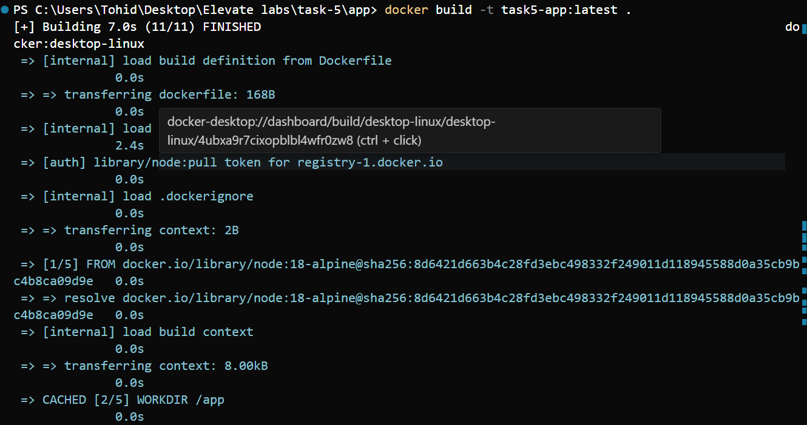
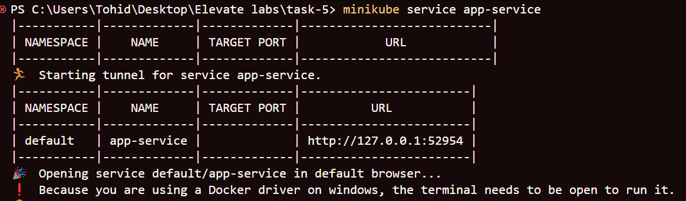
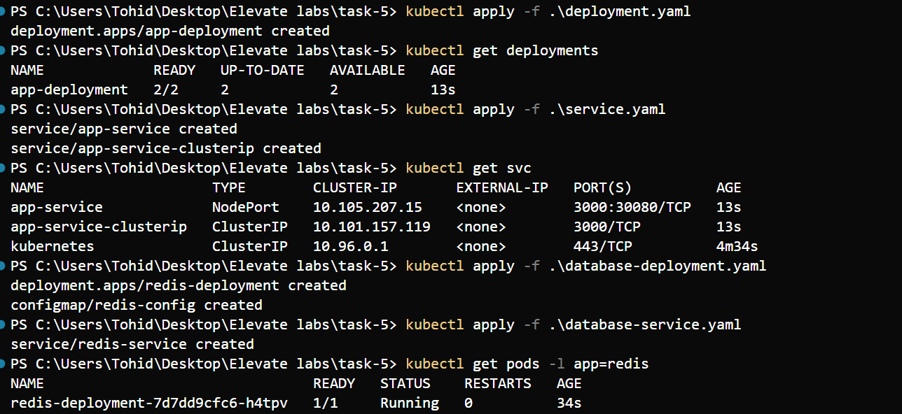
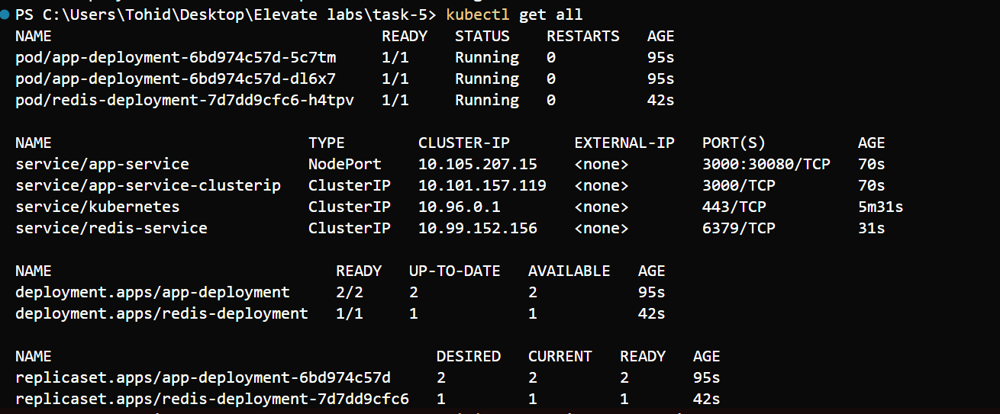
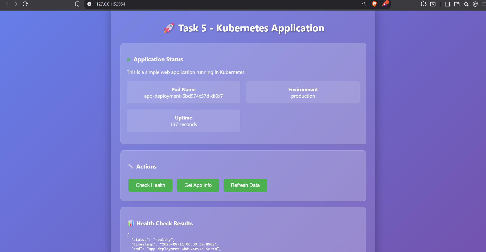
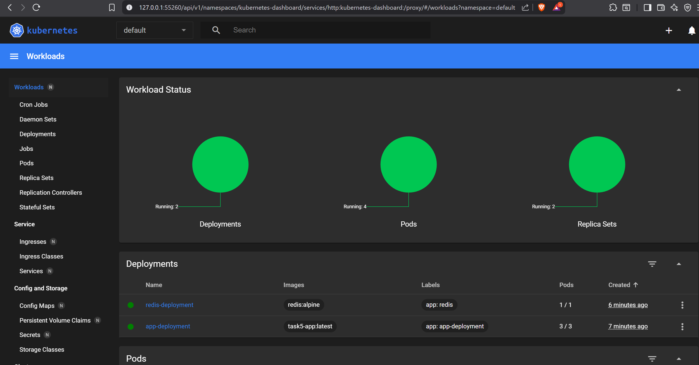
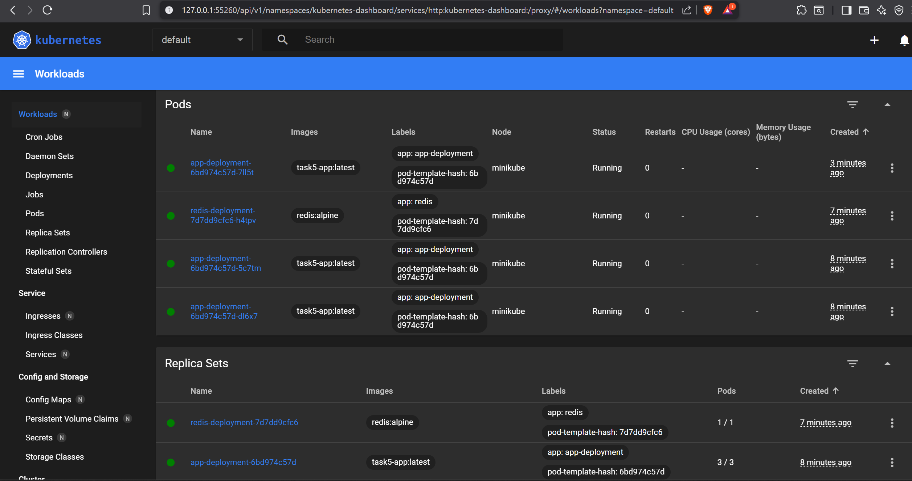
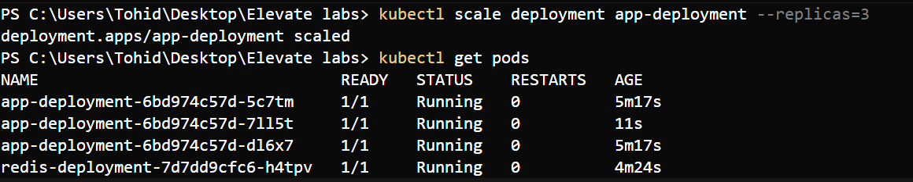
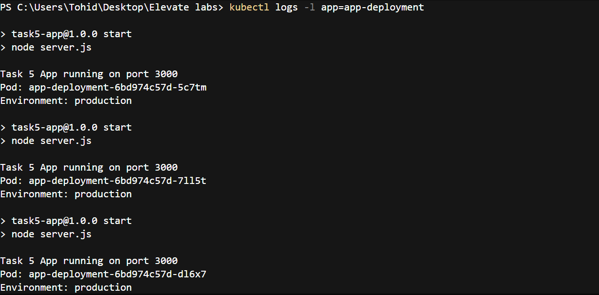

# Task 5: Build a Kubernetes Cluster Locally with Minikube

## 🎯 Objective
Deploy and manage a custom web application in Kubernetes using Minikube for local development.

## 📋 Task Requirements
- Install Minikube & start the cluster
- Create deployment.yaml for an app
- Expose app using service.yaml
- Use kubectl get pods to verify
- Scale deployments using kubectl scale
- Use kubectl describe for logs
- Understand Kubernetes basics and deployments

## 🏗️ What Was Deployed
- **Custom Node.js Express application** with health checks
- **2 replicas** of the application
- **NodePort service** exposing the app on port 30080
- **ClusterIP service** for internal communication
- **Redis database** deployment (optional)
- **Health endpoints** for Kubernetes probes

## 📸 Screenshots Documentation

### 1. Docker Build Process
**File:** `docker-build.png`  
**Description:** Building the custom Node.js application Docker image  
**Command:** `docker build -t task5-app:latest .`



### 2. Minikube Service Status
**File:** `minikube-svc.png`  
**Description:** Minikube service status showing cluster is running  
**Command:** `minikube status`



### 3. All Deployments
**File:** `all-deployment.png`  
**Description:** All Kubernetes deployments showing app-deployment and redis-deployment  
**Command:** `kubectl get deployments`



### 4. Get All Resources
**File:** `get-all.png`  
**Description:** Complete overview of all Kubernetes resources (pods, services, deployments)  
**Command:** `kubectl get all`



### 5. Main Application Running
**File:** `main-app-running.png`  
**Description:** Custom web application running successfully in browser  
**Access:** `minikube service app-service`



### 6. Minikube Dashboard - Overview
**File:** `minikube-dash1.png`  
**Description:** Kubernetes dashboard showing cluster overview and resources  
**Command:** `minikube dashboard`



### 7. Minikube Dashboard - Details
**File:** `minikube-dash2.png`  
**Description:** Detailed view of deployments and pods in the dashboard



### 8. Scaling Demonstration
**File:** `scalling.png`  
**Description:** Scaling the deployment from 2 to 3 replicas  
**Command:** `kubectl scale deployment app-deployment --replicas=3`



### 9. Application Logs
**File:** `logs-app.png`  
**Description:** Viewing application logs from the running pods  
**Command:** `kubectl logs -l app=app-deployment`



## 🎯 Success Criteria Met

✅ **Minikube cluster running locally** - Screenshot: `minikube-svc.png`  
✅ **Custom application deployed with 2 replicas** - Screenshot: `all-deployment.png`  
✅ **Service exposing application on NodePort 30080** - Screenshot: `get-all.png`  
✅ **Application accessible via browser** - Screenshot: `main-app-running.png`  
✅ **Dashboard accessible** - Screenshots: `minikube-dash1.png`, `minikube-dash2.png`  
✅ **Scaling working (2 → 3 replicas)** - Screenshot: `scalling.png`  
✅ **Logs and describe commands working** - Screenshot: `logs-app.png`  

## 🚀 Key Commands Used

```powershell
# Start cluster
minikube start --driver=docker

# Build and load image
docker build -t task5-app:latest .
minikube image load task5-app:latest

# Deploy application
kubectl apply -f deployment.yaml
kubectl apply -f service.yaml

# Verify deployment
kubectl get all
kubectl get pods
kubectl get services

# Scale deployment
kubectl scale deployment app-deployment --replicas=3

# Access application
minikube service app-service

# View logs
kubectl logs -l app=app-deployment

# Open dashboard
minikube dashboard
```

## 📚 What Was Learned

- **Kubernetes deployment concepts** - Pods, Deployments, Services
- **Local development with Minikube** - Cluster setup and management
- **Custom application deployment** - Building and deploying Node.js apps
- **Service types** - NodePort vs ClusterIP and their uses
- **Scaling deployments** - Dynamic replica management
- **Health monitoring** - Liveness and readiness probes
- **Resource management** - CPU and memory constraints
- **Dashboard usage** - Visual cluster management interface

## 🎉 Outcome

Successfully demonstrated understanding of Kubernetes basics and deployments by:
- Setting up a local Minikube cluster
- Deploying a custom web application
- Managing services and scaling
- Using kubectl commands effectively
- Accessing the Kubernetes dashboard
- Documenting the entire process with screenshots

**Task 5 completed successfully! 🚀** 